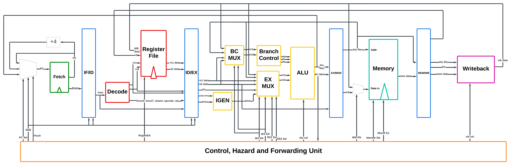

# 32 Bit RISC-V CPU Core 

A 5-stage pipelined 32-bit RISC-V (RV32I) CPU core written in SystemVerilog, featuring hazard detection, forwarding, branch handling, and full instruction-level simulation. Simulated and Verified using both Modelsim and Verilator on multiple Risc-V 32 benchmark programs. 

## Overview
This project implements a custom RV32I CPU core as part of an academic design project.
The goal was to understand modern CPU microarchitecture by designing, simulating,
and verifying a pipelined processor from scratch.

The core follows a classic 5-stage pipeline:
IF → ID → EX → MEM → WB

## Architecture

The following is a simplified data path highlighting the core features and architecture of the core.



## Features 

- RV32I instruction set support
- 5-stage pipelined architecture
- Hazard detection and pipeline stalling
- Data forwarding unit
- Branch handling with pipeline flush
- Unified instruction and data memory with two read ports and one write port
- Parameterized memory depth

## Pipeline Stages 

- **IF (Instruction Fetch)**  
  Fetches instruction from memory and updates PC

- **ID (Instruction Decode)**  
  Decodes instruction and reads registers values

- **EX (Execute)**  
  Performs ALU operations, branch evaluation, immediate generation and address calculation

- **MEM (Memory Access)**  
  Handles load/store instructions

- **WB (Write Back)**  
  Writes results back to the register file

## Hazard Handling

### Data Hazards
- Forwarding from Memory Access and Write Back stages (e.g., MX (MEM to EX), WX (WB to EX) and WM (WB to MEM) bypass paths)
- Stall insertion when forwarding is not possible (e.g., load-use or writeback-decode hazard)

### Control Hazards
- Branch decision resolved in EX stage
- Pipeline flush applied to IF/ID and ID/EX registers on taken branches

## Supported Instructions 

- RV32I Base Integer Instructions
- Currently no extensions are supported

## Toolchain

- SystemVerilog
- Verilator (cycle-accurate simulation)
- ModelSim 
- GTKWave


## Building and Running the Core
Note that the below steps have been tested in a linux environment with ModelSim installed and on a apple silicon macbook with Verilator installed. Additionally you will need to ensure GTKWave is installed on your machine.  

### Step 1: Setup the environment
------------------------------------
Step into the project directory and execute the following command: 
```
source env.sh
```
This will setup the working environment by setting up the paths to the simulator (ModelSim or Verilator) and project root directory.
An expected output after executing this command should look like this:
```
===== EECS 4201 Course Environment Setup =====
Location of project:  /cs/home/kaushika/EECS-4201-project
Verilator version:  Verilator 5.038 2025-07-08 rev UNKNOWN.REV
VSIM version:  Model Technology ModelSim - INTEL FPGA STARTER EDITION vsim 2020.1 Simulator 2020.02 Feb 28 2020
```
### Step 2: Build and Run
------------------------------------
Navigate to the `project/pd5` directory and execute the following command:
```
make compile -C verif/scripts/ VSIM=1
```
If using Verilator, then execute the following command:
```
make compile -C verif/scripts/ VERILATOR=1
```

Once you have finished the compilation, you can run the simulation by executing the following command:
```
make run -C verif/scripts/ VERILATOR=1
```

The above command will re-compile and run the simulation. By default the program will loaded into instruction memory will be Bubble Sort. 

Note that the build command takes an additional command line switch `TEST=` which specifies the RISC-V test program to load in memory. These tests can be found in `pd5/verif/rv-32-bmarks/`.
For example, if you want to load the `pd5/verif/rv-32/CheckVowel.x` program in memory and simulate its execution, then execute the following command:
```
make run -C verif/scripts/ VERILATOR=1 TEST=CheckVowel VCD=1
```
Note the VCD flag ensures waveform can be viewed through GTKWave later on.

### Step 3: Debugging utilities 
------------------------------------
If using modelsim vcd files to be opened in GTKWave are generated into the scripts directory, for Verilator they will be found in `sim/verilaator/test_pd`

### Testing the Core: 
------------------------------------
Running the core following the above steps will run a benchmark program and should output something similar to the following:

``
 *** TEST PASSED *** /Users/kanwarpannu/Desktop/RISC-V_Core/RISCV-CORE/project/pd5/verif/rv32-bmarks/full-bmarks/CheckVowel.x
``
The simulation will also display writes to the memory module a test passed message indicates the program completed with the expected results. 

The benchmarks are of 2 flavors: (1) full program benchmarks and (2) synthetic benchmarks that stress individual functions. For each benchmark, there are 4 files: (1) `*.bin`: the program binary, (2) `*.c`: the C source file, (3) `*.elf`: the corresponding ELF file, (4) `*.objdump`: the object dump listing the sections and RISC-V instructions and location, (5) `*.raw`: instruction data organized in 128-bit lines (4 32-bit instructions per line), (6) `*.s`: Similar to `*.objdump` but lists only the RISC-V instructions, (7) `*.x`: lists only the instruction data where each line corresponds to one 32-bit instruction data. The `*.x` files are used by the design when initializing instruction memory.

## Limitations and Future Work:

- No cache or MMU
- Branch prediction not implemented
- Single-issue in-order pipeline
- Future work:
  - Branch predictor
  - Cache hierarchy
  - RV32M extension
  - Out-of-order design 


## Acknowledgements
------------------------------------
This project was developed as a term project for EECS 4201 at York University, please refer to the branches labeled from pd1-pd5 for the template given in the course and the incremental design process. 
All work is original and intended for educational purposes.
